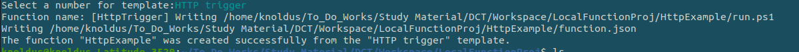

## Description

Here, In this template we will get to know about How to run Azure Function (http) through Powershell script.

---
### Pre-requisite

* Func install
* Dotnet install

---

### Steps:-
1. Login into the AZ account using the `az login`.
2. Go to the script directory and run the file using the following commands: `./createfunction.ps1`

---
### Outputs

1. When we run the script it will import:

2. Then switching into `LocalFunctionProj` directory and Import the template of Http:

Auto-generate directory:-`output files->LocalFunctionProj->HttpExample`

For manual `output files->manually`
3. Hit the Url:- http://localhost:7071/api/HttpExample
provide with `/vikas` for string name

On console use , `curl<Url>` 

---